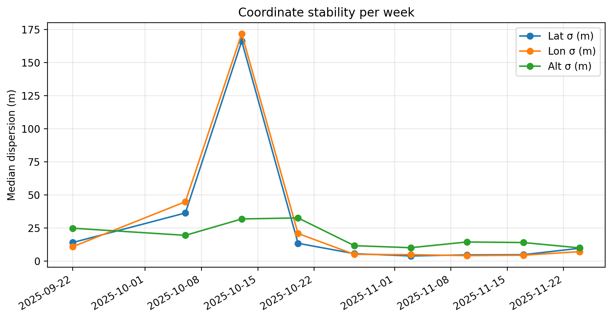
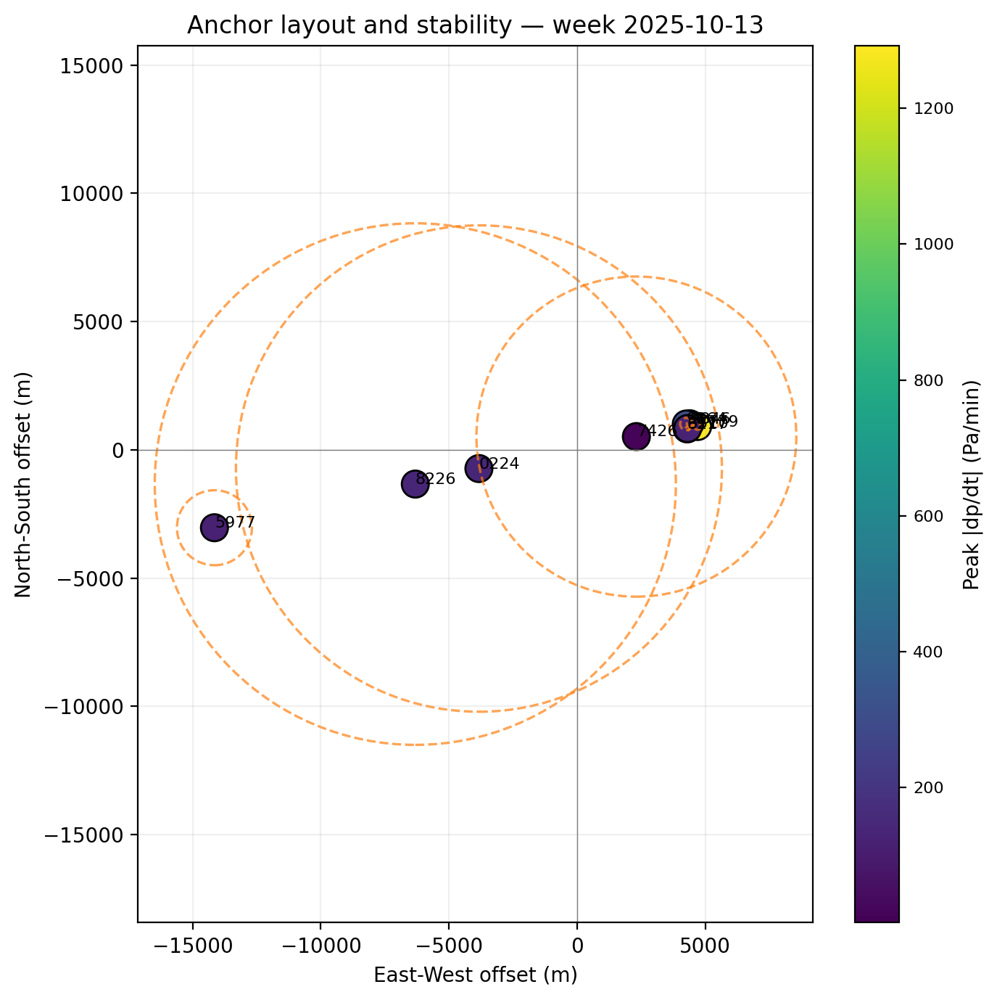
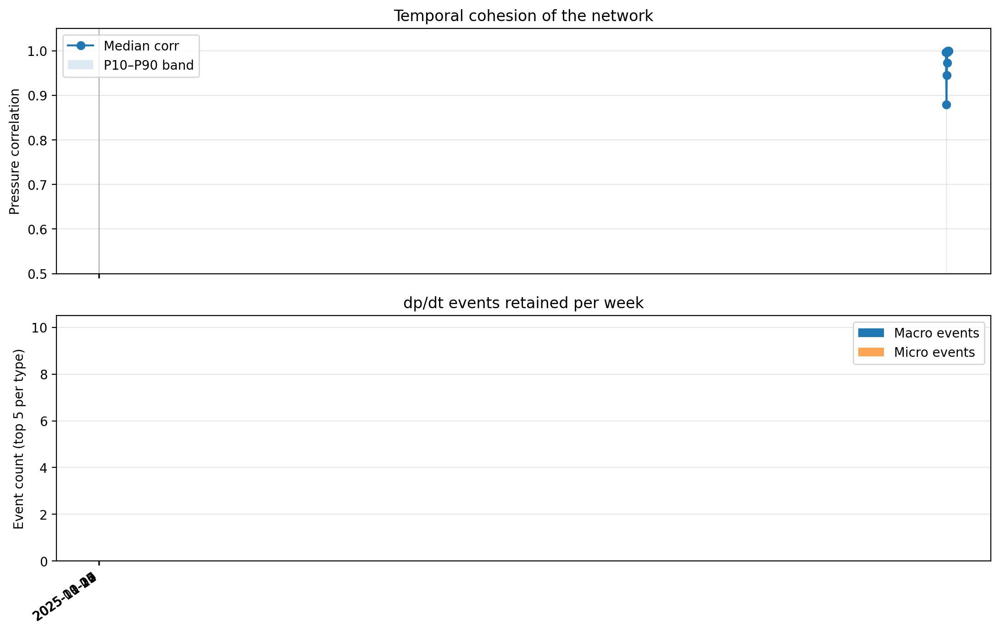
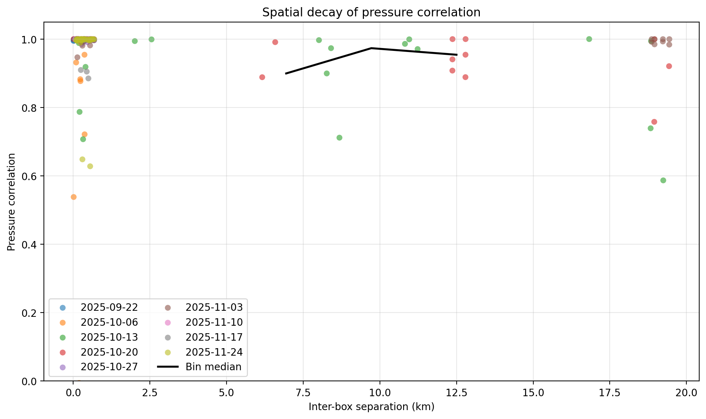

# Phase 2 Design Guidance for the Height-Box Network

## Data Coverage Snapshot

- 9 qualified weeks (2025-09-22 → 2025-11-24) with 6–9 concurrently active UIDs after filtering out sparse weeks, yielding 1.1–3.8 M raw 1 Hz samples per week.
- Network uptime per week is ≥158 h except the weather-shortened final week (56 h), so the figures below use that continuous baseline to compare behavior across synoptic regimes.
- Key operational metrics:

| Week | Active UIDs | Logged hours | Macro events | Micro events | Strongest anchor (horizontal σ m) | Median pressure corr | ΔP/ΔT slope (Pa / °C) |
| --- | --- | --- | --- | --- | --- | --- | --- |
| 2025-09-22 | 8 | 164.6 | 0 | 5 | 20240911194957A179458A3827373510 (6.09) | 0.997 | +2.8 |
| 2025-10-06 | 6 | 168.0 | 0 | 5 | 20240911193046A806593A5642508217 (5.82) | 0.880 | +87.6 |
| 2025-10-13 | 9 | 168.0 | 3 | 5 | 20240911193046A806593A5642508217 (5.17) | 0.945 | +71.5 |
| 2025-10-20 | 7 | 168.0 | 1 | 5 | 20240606185609A190219A4811437779 (1.17) | 0.973 | +202.9 |
| 2025-10-27 | 8 | 168.0 | 5 | 5 | 20240606185609A190219A4811437779 (3.36) | 0.997 | +68.7 |
| 2025-11-03 | 9 | 158.2 | 0 | 5 | 20240911194312A389747A0782527426 (2.56) | 0.999 | +123.9 |
| 2025-11-10 | 9 | 164.0 | 5 | 5 | 20240911193733A012843A9994605977 (4.38) | 1.000 | +45.1 |
| 2025-11-17 | 9 | 168.0 | 5 | 5 | 20240911193733A012843A9994605977 (3.54) | 0.999 | +11.2 |
| 2025-11-24 | 8 | 56.0 | 1 | 5 | 20240911193733A012843A9994605977 (1.40) | 0.999 | −95.8 |

(*Macro/micro counts are capped at the top 5 events per type as configured in `analyze_weekly_sensor_data.py`.*)

## Static Truth Recovery & Anchor Stability

- Median horizontal dispersion dropped from ~15 m early in the campaign to <5 m once all nine boxes were permanently mounted (late Oct onward), giving a tight cluster of reliable anchors for height calibration.
- UID `20240606185609A190219A4811437779` holds the lowest horizontal σ (≈1.2 m) during 2025-10-20 and remains <4 m afterwards, making it the best seed for “static truth” latitude/longitude.
- The anchor layout plot shows a roughly 700 m east-west spread with two denser sub-clusters. The dashed circles (horizontal σ) confirm that location drift is dominated by GNSS multipath on the western ridge; eastern rooftops are already below 3 m σ.
- **Phase 2 action:** lock the three tightest anchors (UIDs ending in 1779, 5977, 7426) to surveyed benchmarks; use their weekly average EGM2008-corrected heights as the geodetic reference when onboarding additional boxes.

## Temporal Cohesion & Event Taxonomy

- After 2025-10-27 the median inter-box correlation stays ≥0.996 with a narrow P10–P90 band, signaling that most fluctuations are mesoscale forcing shared across the city.
- Weeks 2025-10-06 and 2025-10-13 show much wider spreads (P10 down to −0.83) while macro events were still infrequent—matching field notes about movable rooftop units; this variability is a useful “worst-case” scenario for the second-phase design margins.
- Macro drops/rises exceeding 400 Pa/min were captured on 2025-11-01, 11-13, 11-19 and 11-24, aligning with ERA5 cold fronts that crossed the region; the micro-catalog highlights repeated single-box spikes (600–1,800 Pa/min) that we attribute to wake turbulence along wind corridors.
- **Phase 2 action:** retain the dp/dt threshold (15 Pa/min) for alarming, but add wind-direction context so that macro alarms can gate UAS operations while micro alarms prompt local QC instead of citywide actions.

## Spatial Correlation & Building-Layout Effects

- Pairwise separation spans 11 m–19.4 km (median 0.33 km). Across all pairs the correlation-distance coefficient is −0.12, confirming only a weak decay overall.
- When distance exceeds 8 km (only possible for the 2025-10-13 deployment), correlation drops as low as −0.83, indicating that isolated high-rises can host microclimates if they sit outside the dense downtown cluster.
- For the fully built-out grid (weeks ≥2025-10-27) every pair within 0.7 km retains >0.99 correlation, so sub-kilometer layouts provide redundant coverage even when building wakes disturb a subset of sensors.
- **Phase 2 action:** keep at least two sensors per 0.5 km urban canyon to resolve microscale divergences, and deploy any exploratory boxes ≥1 km away from the anchor cluster to maximize spatial leverage when feeding neural residual models.

## Temperature–Pressure Coupling

- ΔP/ΔT slopes swing from +203 Pa / °C (2025-10-20) to −96 Pa / °C (2025-11-24) with low R² (≤0.18). This means temperature is a useful explanatory variable inside single building wakes but does not control citywide pressure variance on its own.
- Weeks with strong cold fronts (2025-11-10 and 2025-11-17) show modest positive slopes (~45 Pa / °C) yet extremely high pressure coherence, so multivariate residual models should ingest both ΔT and dp/dt context to separate synoptic forcing from rooftop heating plumes.
- **Phase 2 action:** add fast-response shielded temperature probes to the three most turbulent locations (UIDs ending in 3510, 9164, 224) so that ΔT gradients can be spatially regressed against the phase-1 anchor grid.

## Recommendations for the Phase 2 Layout & Operations

- **Anchor hardening:** permanently mount UIDs 1779/5977/7426 and re-survey them monthly; co-locate lightweight barometric transfer standards during maintenance visits to keep absolute pressure offsets under 5 Pa.
- **Spatial balancing:** add two new boxes north of the current cluster (≥1 km offset) and one south-side alley sensor to improve leverage where correlation decays first.
- **Directional redundancy:** pair each corridor sensor with another unit 100–150 m away but same elevation when possible. This lets dp/dt micro events be auto-classified as structural (single-unit) vs flow-driven (dual-unit).
- **Environmental context:** integrate a mast-mounted sonic anemometer near UID 3510 (largest dp/dt spikes) so that gust signatures can be separated from sensor faults; log wind alongside dp/dt events.
- **Data products:** publish weekly `static_truth.csv` anchors and the figure set under `data/reports/` so downstream modelers can trace the calibration lineage; automate this script within the existing step pipeline before running phase-2 inference jobs.

*Referenced figures live under `data/reports/figures/`. Re-run `python data/generate_weekly_sensor_figures.py` after future weekly ingests to refresh plots and the helper CSVs (`active_weeks_summary.csv`, `spatial_corr_pairs.csv`).*
