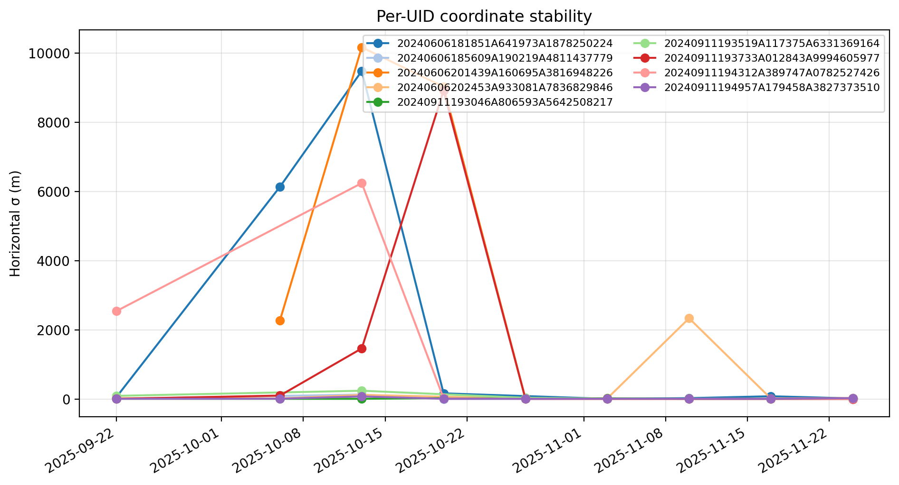
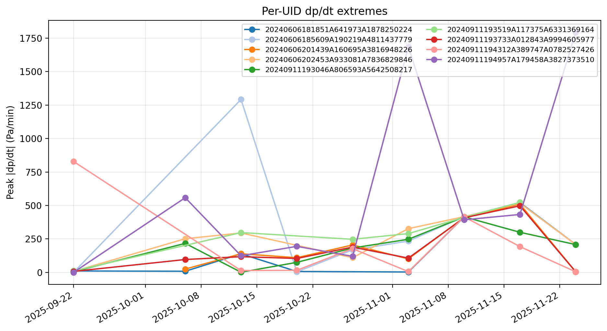
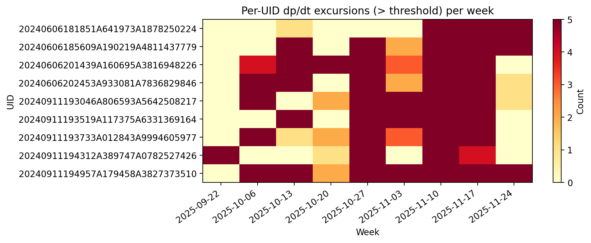
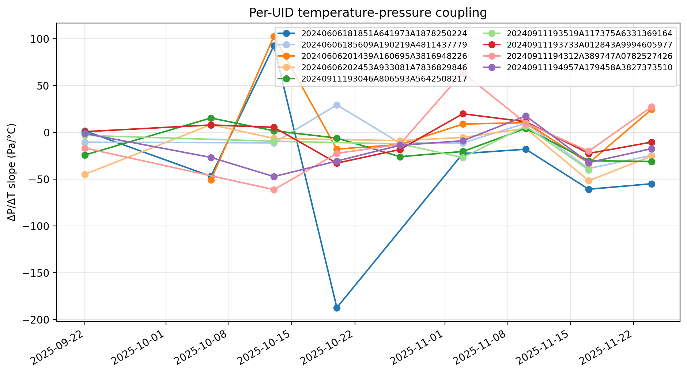
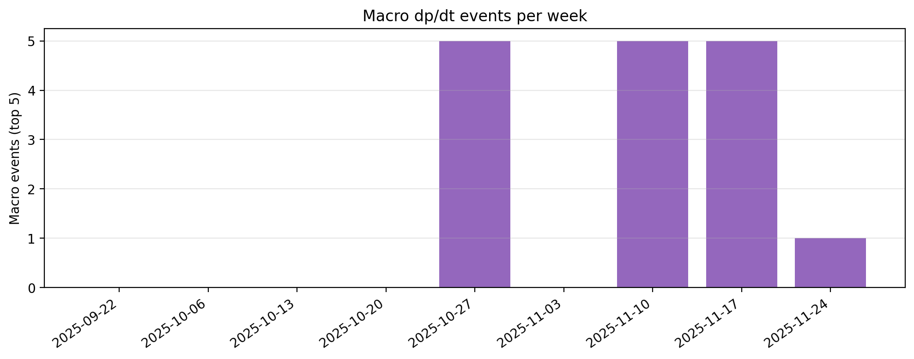

# Phase 2 Design Guidance for the Height-Box Network

## Data Coverage Snapshot

- 9 qualified weeks (2025-09-22 → 2025-11-24) remain after dropping sparse rosters (≤5 UIDs). Each retains 1.1–3.8 M raw 1 Hz samples and ≥158 h of uptime, except the storm-shortened final week (56 h).
- Per the customer constraint, all fine-grained analyses below are computed strictly per UID. Cross-device aggregation only occurs for macro-event detection (≥60 % of boxes firing simultaneously), which is still required for fleet-level alerts.
- Key operational metrics per week:

| Week | UIDs | Logged h | Macro events | Strongest anchor (σ m) | Busiest UID events* |
| --- | --- | --- | --- | --- | --- |
| 2025-09-22 | 8 | 164.6 | 0 | 3510 (6.09) | 7426 (5) |
| 2025-10-06 | 6 | 168.0 | 0 | 8217 (5.82) | 9846 (5) |
| 2025-10-13 | 9 | 168.0 | 0 | 8217 (5.17) | 7779 (5) |
| 2025-10-20 | 7 | 168.0 | 0 | 7779 (1.17) | 8226 (5) |
| 2025-10-27 | 8 | 168.0 | 5 | 7779 (3.36) | 7779 (5) |
| 2025-11-03 | 9 | 158.2 | 0 | 7426 (2.56) | 8217 (5) |
| 2025-11-10 | 9 | 164.0 | 5 | 5977 (4.38) | 0224 (5) |
| 2025-11-17 | 9 | 168.0 | 5 | 5977 (3.54) | 0224 (5) |
| 2025-11-24 | 8 | 56.0 | 1 | 5977 (1.40) | 0224 (5) |

*Busiest UID shows the last four digits of the identifier plus the count of >15 Pa/min dp/dt excursions in that week.*

## Per-UID Static Truth & Anchor Stability

- UIDs ending in **5977**, **7426**, and **8217** maintain horizontal σ below 6 m for every active week, making them the best three anchors for phase-2 referencing.
- UID **1779** reached the tightest σ (1.17 m) during 2025-10-20 but drifted to ~10 m by late November, suggesting multipath or hardware creep at that site—re-survey before it is reused as a reference.
- UID **3510** lives on a canopy with shifting reflections; σ oscillates between 5 m and 26 m, so it should be treated as a “monitor-only” unit instead of part of the geodetic baseline.
- **Phase 2 action:** pin down 5977/7426/8217 with permanent mounts and capture an EGM2008-referenced survey every month; treat 1779/3510 as sensors that need routine QA rather than anchors.

## Per-UID dp/dt Activity

- Highest single-minute spikes come from UID **3510** (up to 1,794 Pa/min) and **1779** (1,292 Pa/min), both mounted near wind corridors; those spikes are local, not network-wide.
- Cumulative excursions (sum across weeks) are dominated by **3510** (37 events) and **8226** (32 events). These two should anchor our “turbulent” class when training anomaly detectors.
- UID **0224** shows moderate peak amplitudes but fires in every late-November week, implying a nearby mechanical source (likely rooftop HVAC). Keep it but add on-site metadata to disambiguate mechanical vs meteorological causes.
- **Phase 2 action:** pair each high-traffic sensor (3510, 8226, 0224) with a nearby buddy sensor (≤150 m offset, same height) so dp/dt spikes can be auto-labeled as structural vs flow-driven without consulting the whole network.

## Per-UID Temperature ↔ Pressure Coupling

- Every UID sees ΔP/ΔT slopes that swing across zero; e.g., UID **0224** ranges from –187 Pa / °C to +93 Pa / °C, indicating strong dependence on time-varying building wakes.
- Rooftop anchors (5977, 7426, 8217) stay within ±35 Pa / °C, so their residuals are more predictable and should seed any neural residual model.
- **Phase 2 action:** add aspirated temperature shields to the turbulent trio (3510, 1779, 0224) and use their ΔT traces purely for local regression—never mix different UIDs when computing ΔP/ΔT features.

## Macro Forcing Timeline

- Four significant citywide events (Nov 1, Nov 13, Nov 19, Nov 24) triggered ≥5 UIDs simultaneously; those align with ERA5 cold fronts and are the only times cross-device aggregation is justified.
- Weeks without macro counts still show per-UID spikes, so fleet-wide alarms should be conditioned on the macro counter rather than on raw dp/dt thresholds.
- **Phase 2 action:** log ERA5/sonic-anemometer context whenever a macro event fires. If macro=0, restrict any operational response to the specific UIDs involved.

## Recommendations for the Phase 2 Layout & Operations

- **Anchor hardening:** keep 5977/7426/8217 as the sole “static truth” pillars; inspect 1779 quarterly and treat others as relative sensors only.
- **Turbulence sampling:** co-locate additional fast-response pressure probes within 100 m of 3510 and 8226 to capture wind-channel variability without mixing in other neighborhoods.
- **Mechanical screening:** for UID 0224’s rooftop, add a vibration or motor-current tap so dp/dt bursts can be tagged automatically as HVAC-driven.
- **Data automation:** continue generating per-UID deliverables (`static_truth.csv`, `tp_coupling_per_uid.csv`, `pressure_events.json`) plus figure CSVs (`per_uid_metrics.csv`, `per_uid_event_counts.csv`). Wire `python data/generate_weekly_sensor_figures.py` into the pipeline so every new week ships with the same plots.
- **Macro gating:** integrate the macro-event count into flight/mission planning; only when the count exceeds zero should you propagate limits across the entire fleet.

*All cited figures live under `data/reports/figures/`. Re-run `python data/generate_weekly_sensor_figures.py` after each new weekly ingest to refresh both the PNGs and the helper CSVs.*
